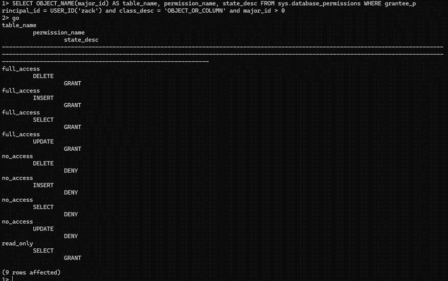

# Database README

## Database Name
- **SystemIntegration-kea**

## Connection Information
- **Connection string**: systemintegration-user-access-new.database.windows.net

## Users
- **Login**: zack
- **Password**: P@ssword1

## Tables
- **read_only**
  - Users can only perform SELECT operations.
- **full_access**
  - Users can perform SELECT, INSERT, UPDATE, and DELETE operations.
- **no_access**
  - Users cannot access the table at all.

## How to Access
1. Open terminal.
2. Execute the following command:

